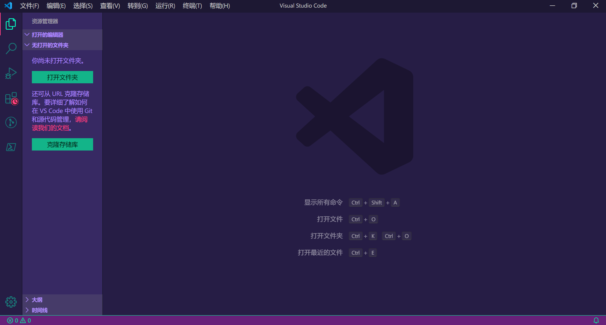
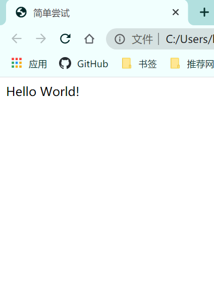

# 前言

## Web诞生

### Internet

中文正式译名为因特网，又叫作国际互联网，是由所有使用公共语言互相通信的计算机连接而组成的全球网络。

### 起源发展

20世纪60年代美国国防部高级研究计划局（ARPA）建设了一个军用网，叫做“阿帕网”（ARPAnet），于1969年正式启用。、

1992年，美国IBM、MCI、MERIT三家公司联合组建了一个高级网络服务公司（ANS），建立了一个新的网络，使Internet开始商用化。

### WWW（万维网）

WWW是World Wide Web的缩写，也可以写为W3，中文名为万维网。是集文本、声音、图像、视频等多媒体信息于一身的全球信息资源网络。用户通过浏览器在WWW中搜索和浏览自己感兴趣的所有信息。

# Web开发介绍

Web开发分为前端开发与后端开发，在以前是不区分前后端的，前后端的相互独立开发减少了业务难度，也使得后端的错误不会直接反映到前端。

## 前端开发

前端指的是直接与用户接触的网页，网页上通常有HTML、CSS、Javascript等内容。

## 后端开发

后端指的是程序、数据库和服务器层面的开发。

## Web开发的标准

Web应用开发需要遵循的标准就叫Web标准，这里Web标准是一系列标准的集合。
网页主要由三部分组成：结构标准（`XML`、`HTML`和`XHTML`），表现标准（`CSS`），行为标准（`DOM`、`Javascrip`）。

### HTML

`HTML`用来构成网页的内容，内容就是网页制作者放在页面上想让用户浏览的信息，例如文字、图片、视频等等，简单来说就是用来定义网页的内容。

### CSS

`CSS`决定网页样式的展现，也就是网页的外观。

### JavaScript

`JavaScript`定义网页上的交互，控制网页的行为。

# 开发工具

开发工具可以使用微软的`VScode`，它具有丰富的插件，能够快速进行开发。



# HTML发展史

## HTML概念

`HTML`又叫做超文本标记语言，用来构建网页的一种标记语言

## HTML历史

* 1993年由互联网工程工作小组（IETF）发布工作草案1995年发布HTML2.0版本

* 1997年1月14日由W3C发布HTML3.2版本

* 1997年12月18日由W3C发布HTML4.0版本

* 1999年由W3C发布HTML4.01版本

* 2000年由W3C发布XHTML1.0版本，它是一种更严格的HTML代码

## XHTML

`XHTML`是可扩展超文本标记语言，是一种更加严格、更加纯净的`HTML`语言。

### `XHTML`与`HTML`的区别

* `XHTML`元素必须被正确地嵌套

* `XHTML`元素必须被关闭

* 标签名必须用小写字母

* `XHTML`文档必须拥有根元素

### HTML语义化

`HTML5`中新增加了很多语义化标签，不同的`HTMI`标签代表了不同的网页内容。

#### 语义化 优势

* 语义化`HTML`会使`HTML`结构变的清晰，有利于代码的维护

* 有利于搜索引擎抓取

* 语义化使代码仍具可读性

* 语义化会使`HTML`代码变得更简洁，提高页面加载速度

* 语义化有助于屏幕阅读器等设备的识别

# HTML初识

## HTML标签

### 单标签

单标签：只有一个标签就能表达完整的含义

例如：`<input/>```。

### 双标签

双标签：由开始标签和结束标签一起组成

例如：`<div></div>``<span></span>`

## 元素

一对标签包含的所有内容，其中元素的内容是指开始标签和结束标签之间的内容。

例如：`<div>Hello World</div>`

## 属性

标签可以有很多属性，属性总是在开始标签中定义，而且是以名值对的形式出现，其中属性值以双引号包裹。

例如：``

## 一个简单的页面

```html
<!DOCTYPE html>
<html lang="en">
<head>
  <meta charset="UTF-8">
  <meta name="viewport" content="width=device-width, initial-scale=1.0">
  <title>简单尝试</title>
</head>
<body>
  <div>Hello World!</div>
</body>
</html>
```

