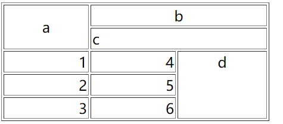

# HTML常用标签

## 基本结构

```html
<!DOCTYPE html>
<html lang="en">
  <head></head>
  <body></body>
</html>
```

如上代码是`HTML`的一个基本结构，`<!DOCTYPE html>`是`HTML5`的文档声明标签，表示这个文档是`HTML5`的文件，`html`对大小写并不敏感，即使用大写的代码也会最终当作小写进行处理的，但是为了代码的规范，除了声明标签，其它的`html`标签均使用小写。

`<html></html>`是`html`的根标签，`lang=en`表示这个页面是英文的，`<html></html>`标签中包含着`<head></head>`和`<body></body>`标签，`<head></head>`中可以包含这个文档编码方式、标签名和这个文档的层叠样式和`JS`等内容。

```html
<head>
  <meta charset="UTF-8">
  <title>Document</title>
</head>
```

`<meta charset="UTF-8">`表明这个页面的编码方式是`UTF-8`，`<title>Document</title>`表示这个页面的标签名是`Document`，最终会反映到浏览器渲染的页面上。


`<body></body>`中定义整个页面的内容。

我们可以在编辑器中保存我们所写的页面为`HTML`文件（后缀名为`.html`），然后通过浏览器打开，也可以凭借VScode丰富的插件来打开文件，有关VScode的插件用法可以在网上查阅相关信息。

## 标题标签

```html
<!DOCTYPE html>
<html lang="en">
<head>
  <meta charset="UTF-8">
  <meta name="viewport" content="width=device-width, initial-scale=1.0">
  <title>Document</title>
</head>
<body>
  <h1>标题1</h1>
  <h2>标题2</h2>
  <h3>标题3</h3>
  <h4>标题4</h4>
  <h5>标题5</h5>
  <h6>标题6</h6>
</body>
</html>
```


之后的代码将不给出完整代码，只给出必要代码。

`<h1>`~`<h6>`标签就好比在word里写段落时的段落标题的级别，`h1`是最高的级别，也会被渲染成字体最大的级别。被包裹在标签内的是它的文本内容，最终会被浏览器渲染出来。

## 段落标签`<p>`

有段落标题自然会有段落，段落标签使用的是`<p></p>`，同样标签内包裹文本内容，

```html
<p>Lorem ipsum dolor sit amet consectetur adipisicing elit. 
  Ex, aperiam pariatur beatae reiciendis saepe dolore vero 
  ratione molestiae sint eligendi ab odit veniam unde facere 
  provident explicabo rem? Earum, odio!</p>
```


需要注意的是，标签里的文本内容会依据浏览器的大小自动折行（实际上文本内容是依据标签大小折行的，而标签大小则依据浏览器视口大小），这也是`html`的优势。

## div标签与span标签

如果说有最基本的元素，那么`<div>`标签可以算作基本标签，`<div>` 可定义文档中的分区或节（division/section）。

`<div>`标签可以把文档分割为独立的、不同的部分。它可以用作严格的组织工具，并且不使用任何格式与其关联。

`<div>`标签是一个块级标签，可以作为一个容器包裹其它元素进行使用。

`<span>`标签是一个内联标签，用在一行文字中。

```html
<div>Hello</div>
<div>World</div>
<span>Hello</span>
<span>World!</span>
```


上述代码渲染成的页面如上图所示，可以看到`<div>`在默认情况下一个标签占据浏览器一行，并且高度由内部文本内容决定，而`<span>`默认时，高度由文本内容决定，宽度也由内部文本内容决定，可以在浏览器内按F12详细查看这两个标签的信息：


通过`div`就能将页面内容划分开，再配合`css`层叠样式就能得到想要的页面效果。

## 链接

在一个网页中经常存在一段文字或图片点击时就能跳转到其它页面，这就是通过`<a>`标签做到的效果。

```html
<a href="http://www.baidu.com">
  <span>点击访问百度</span>
</a>
```


在`a`标签内包裹着`span`标签，`span`内是我们想要通过点击它就能跳转的文字。

`a`标签内的`href`属性可以指定我们要跳转的页面，上述是百度官网。`a`标签还含有一个`target`属性，默认的值是`_self`，表示如果点击链接那么会在当前窗口打开链接，还可以设置成`_blank`表示在新窗口中打开链接。

## 图片标签

图片标签使用``来表示，它有两个基本属性，一个是`src`，代表图片地址，一个是`alt`，表示图片无法显示时的替代文本。

`src`属性可以使用相对路径，也可以用绝对路径。

```html

```

以上所使用的就是绝对路径。因为`html`文件最终会部署到服务器内，所以使用类似`./../`这个方式是可以遍历到以当前文件为起点的其它文件的，例如，`./hello.txt`访问的是同级目录中的`hello.txt`文件，而`./../hello.txt`访问的是父级目录中的hello.txt文件，其它有关相对路径知识请自行百度解决，此处不再赘述。

还可以为`img`设置`title`属性，当鼠标悬浮在图片上方时，会显示设置的`title`内容。

## 列表

在word中经常可以通过`项目符号`在一个个项目前添加符号，在html中也有列表标签`<li>`来达到相似的效果。

### 有序列表

```html
<ol>
  <li>项目1</li>
  <li>项目2</li>
  <li>项目3</li>
  <li>项目4</li>
  <li>项目5</li>
  <li>项目6</li>
  <li>项目7</li>
</ol>
```


如上代码所示，有序列表用`<ol>`标签去包裹列表中的每一项内容`<li>`，被浏览器渲染出来时，列表中的每一项默认以数字开头排序。

在`<ol>`中设置`type`属性可以更改以数字作为开头的列表排序方式，比如设置`type='a'`就能以小写英文字母作为排序规则。

```html
<ol type="a">
  <li>项目1</li>
  <li>项目2</li>
  <li>项目3</li>
  <li>项目4</li>
  <li>项目5</li>
  <li>项目6</li>
  <li>项目7</li>
</ol>
```


### 无序列表

无需列表用`<ul>`来包裹列表中的每一项目，它默认被浏览器渲染出来的效果是列表的每一项前都有一个黑色的圆点。

```html
<ul>
  <li>项目1</li>
  <li>项目2</li>
  <li>项目3</li>
  <li>项目4</li>
  <li>项目5</li>
  <li>项目6</li>
  <li>项目7</li>
</ul>
```


同样的，`ol`也可以通过设置`type`来设置排序的样式，`type=square`时，渲染出来的效果是每一项前都有一个黑色方块。

### 自定义列表

```html
<dl>
  <dt>项目标题a</dt>
  <dd>项目a.1</dd>
  <dd>项目a.2</dd>
  <dd>项目a.3</dd>
  <dd>项目a.4</dd>
  <dd>项目a.5</dd>

  <dt>项目标题b</dt>
  <dd>项目b.1</dd>
  <dd>项目b.2</dd>
  <dd>项目b.3</dd>
  <dd>项目b.4</dd>
  <dd>项目b.5</dd>
</dl>
```


如上是自定义列表的基本结构。

`<dl>`标签用来表示自定义列表，被它包裹的`dt`标签是自定义列表的标题标签，`dd`是每一项自定义列表的内容。

`dl`是description list的缩写，`dt`description title的缩写，`dd`是description definition的英文缩写，在了解英文语义时，就能很方便的进行记忆。

## 表格

表格的基本内容：

```html
<table>
  <caption>表格标题</caption>
  <tr>
    <th>表头1</th>
    <th>表头2</th>
    <th>表头3</th>
  </tr>
  <tr>
    <td>表格内容1</td>
    <td>表格内容2</td>
    <td>表格内容3</td>
  </tr>
  <tr>
    <td>表格内容1</td>
    <td>表格内容2</td>
    <td>表格内容3</td>
  </tr>
</table>
```


以上会被渲染出没有边框的表格出来，`<table>`标签表示接下来的区域是表格内容。

`<caption>`标签定义表格的标题，`<tr>`标签表示一行表格的内容，`<th>`定义表格的表头内容，而`<td>`则定义出表格基本单元格内容。

为了增添表格的语义化，增加`<thead>`、`<tbody>`、`<tfoot>`标签：

```html
<table>
  <caption>表格标题</caption>
  <tr>
    <th>表头1</th>
    <th>表头2</th>
    <th>表头3</th>
  </tr>
  <tr>
    <td>表格内容1</td>
    <td>表格内容2</td>
    <td>表格内容3</td>
  </tr>
  <tr>
    <td>表格内容1</td>
    <td>表格内容2</td>
    <td>表格内容3</td>
  </tr>
</table>
<table>
  <caption>表格标题</caption>
  <thead>
    <tr>
      <th>公司名称</th>
      <th>资金</th>
      <th>税务</th>
    </tr>
  </thead>
  <tbody>
    <tr>
      <td>甲公司</td>
      <td>1300</td>
      <td>300</td>
    </tr>
    <tr>
      <td>乙公司</td>
      <td>1700</td>
      <td>300</td>
    </tr>
    <tr>
      <td>丙公司</td>
      <td>2010</td>
      <td>400</td>
    </tr>
  </tbody>
  <tfoot>
    <tr>
      <td>总计</td>
      <td>5010</td>
      <td>1000</td>
    </tr>
  </tfoot>
</table>
```


`tr`是table row的英文缩写，表示表格中的行；
`th`是table head的英文缩写，表示表头；
`td`是table data的英文缩写，表示表格中的基本单元格。

### 表格属性


对于如上这样有着合并跨越、并且还含有居左对齐和顶端对齐的表格，接下来我们将单纯依靠html的属性来完成。

```html
<table border="1" width="300" height="100">
  <tr>
    <td rowspan="2" align="center">a</td>
    <td colspan="3" align="center">b</td>
  </tr>
  <tr>
    <td colspan="3" align="left">c</td>
  </tr>
  <tr>
    <td align="right">1</td>
    <td align="right">4</td>
    <td rowspan="3" colspan="2" align="center" valign=top>d</td>
  </tr>
  <tr>
    <td align="right">2</td>
    <td align="right">5</td>
  </tr>
  <tr>
    <td align="right">3</td>
    <td align="right">6</td>
  </tr>
</table>
```



如上，设置单元格合并跨越是通过为`td`标签设置`rowspan`与`colspan`属性达到的，`rowspan`是要跨越合并的行的数目，`colspan`则是列的数目。对齐方式则通过`align`与`valign`完成，`align`是水平对齐方式，`valign`是列对齐方式`。

表格的边框则通过为`table`设置`border`属性以达到。

以上是通过html的属性做出的表格效果，但是建议将表格效果通过css达到，html应当更多地偏重于页面结构地设置与语义化。
