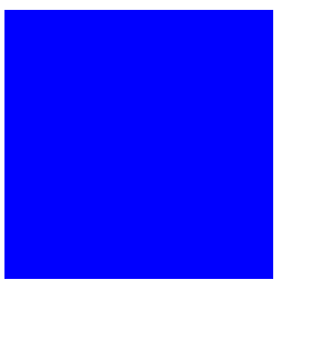
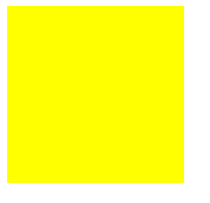

# CSS初识

CSS的英文全称是Cascading Style Sheets，即层叠样式表。

CSS是一种样式表现语言，主要用于对网页样式的定义，例如布局、颜色、文本的设计，简单来说，HTML定义了网页上所有需要的元素，而CSS则是定义这些元素的样式，例如它能控制元素的形状大小。

## CSS历史

* CSS1.0发布于1996年12月。

* CSS2.0发布于1998年5月，提供了更加强大的功能。

* CSS2.1版本发布于2007年，并于2011年6月正式成为标准，是目前使用最为广泛的版本。

* CSS3.0版本发布于1999年开始制定，2001年完成工作草案，是目前CSS最新的版本。它将CSS3的规范内容分成了一系列的模块，更有利于浏览器厂商的逐步支持。

## CSS在网页中的引用

有四种方式可以在网页文件中使用CSS样式，

### 内联样式

将CSS样式直接写到HTML元素的`style`属性中，例：

```html
<div style="width: 200px; height: 200px; background-color: #ccc;"></div>
```


### 内部样式

将CSS样式写到`<style>`标签中，例：

```html
<!DOCTYPE html>
<html lang="en">
<head>
  <meta charset="UTF-8">
  <meta name="viewport" content="width=device-width, initial-scale=1.0">
  <title>Document</title>
  <style>
    .box{
      width: 200px;
      height: 200px;
      background-color: blue;
    }
  </style>
</head>
<body>
  <div class="box"></div>
</body>
</html>
```



### 引入外部样式

精确通过`<link>`样式引入外部的一个CSS文件，这也是使用最为广泛的一种方式。

```html
<!--3new.html-->
<!DOCTYPE html>
<html lang="en">
<head>
  <meta charset="UTF-8">
  <meta name="viewport" content="width=device-width, initial-scale=1.0">
  <title>Document</title>
  <link rel="stylesheet" href="./css/3new.css">
</head>
<body>
  <div class="box3"></div>
</body>
</html>
```

```css
/* 3new.css */
.box3{
    width:200px;
    height: 200px;
    background-color: yellow;
}
```



### 导入外部样式

通过`<style>`元素中，使用`@import`导入一个外部的CSS文件，最好别用，一些落后的浏览器不支持。

## CSS基本语法

CSS样式由三部分组成：选择器、属性和值，CSS选择器包括HTML选择器、class选择器、id选择器。

### HTML选择器

HTML选择器是以HTML标签作为选择器，其作用域为所有符合条件的HTML标签，例：

```css
h1{
  text-align: center;
  color: blue;
}
```

那么所有`h1`标签的样式都会被修改成如上样式（不包含还有其它样式作用`h1`元素的情况）。

### class选择器

使用HTML标签的`class`属性值作为选择器。定义class选择器时，前面需要加"."标志。

class选择器可以为相同及不同元素定义不同与相同样式。

#### 为相同元素定义不同样式

```css
.warning{
  font-size:20px;
}
.danger{
  font-size:30px;
}
```

```html
<!--HTMLbody代码-->
<p class="warning">这是warning样式</p>
<p class="danger">这是danger样式</p>
```

以上是为相同的`p`元素定义了两种不同的样式，如果元素要使用不同的样式，就需要在元素的属性内添加`class`属性。在`CSS`中，花括号包裹的是这一选择器所定义的样式，每一条样式以`;`结尾。

### id选择器

使用HTML标签的`id`属性值作为选择器，用来定义某一特定的HTML标签，在id选择器前加“#”标志。

例：

```css
#red{
  color: red;
}

#green{
  color: green;
}
```

```html
<!--HTML中的body代码-->
<p id="red">这个段落是红色的</p>
<p id="green">这个段落是绿色的</p>
```

id选择器与class选择器类似，但是这两者有以下区别：

1. 一个`id`只能在文档中使用一次，而`class`可以重复使用。

2. id选择器不能结合使用，id属性不允许有以空格分隔的词列表，`class`可以结合使用，一个HTML元素可以同时具有多个class属性值。例：`<div class="box none top"></div>`

### 其它选择器

除了以上三种使用比较广泛的选择器外，还有其它几种类型的选择器。

#### 派生选择器

后代选择器是指用空格分隔开的两个或多个单一选择器组成的字符串，例：

```html
div p{
  color: red;
  font-size: 12;
}
```

主要用来对某些具有包含关系的元素定义样式，如元素一包含元素二，使用包含选择器定义的样式那么只会对在元素一中包含的元素二起作用。

除了包含后代的选择器外，还有其它几种包含选择器：

1. 子元素选择器，语法为`父元素 > 子元素{property: value;...}`，用来选择某元素的第一级子元素。

2. 兄弟选择器，语法为`父元素 + 子元素{property: value;...}`，用来选择紧跟在一个元素后面的元素。

### 组合选择器

为了减少样式表的重复使用，可以在一条样式规则定义语句中组合若干个选择器，选择器用逗号隔开，例：

```css
h1,
h2,
h3{
  color: red;
}
```

这样这个样式就能对`h1`、`h2`、`h3`元素都能发挥作用。

#### 伪元素选择器

伪元素选择器是指同一个HTML元素的各种状态和部分内容的一种定义方式。

例：超链接元素`a`的四种伪类是：

* `a: link`表示超链接正常状态；

* `a: visited`表示访问过的状态；

* `a: hover`表示鼠标在超链接上的状态；

* `a: active`表示被选中过的状态。

#### 属性选择器

对拥有某种属性的元素可以使用属性选择器，例：

```html
<input type="text/>
```

```css
input[type]
```

属性选择器也有其它几种用法：

1. `[attribute=value]`，选取含有指定属性值的指定属性。

2. `[attribute~=value]`，选取属性值中包含指定属性值的元素。

3. `[attribute|=value]`，以指定值开头的属性值元素。

### 选择器优先级

当一个元素被多个选择器作用时，首先是id选择器的样式的优先级高于class选择器的样式的优先级，class选择器的样式高于HTML标签选择器的样式，那么最终的样式将会受`id`控制。

如果想要某一样式拥有最高级别的优先级，可以在这个样式内部添加`!important`，例：

```css
table td { height: 50px !important; }
```

最好不要使用这个语法去破坏优先级。
