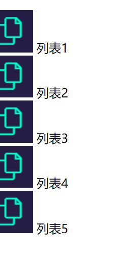
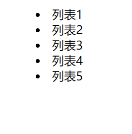
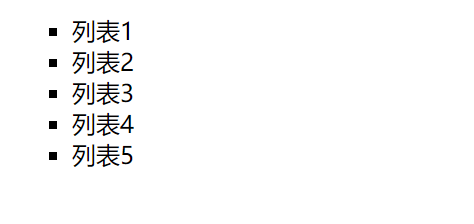
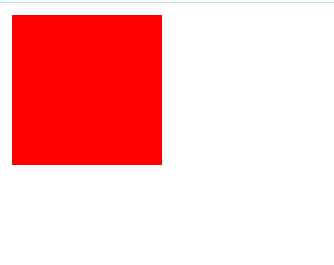
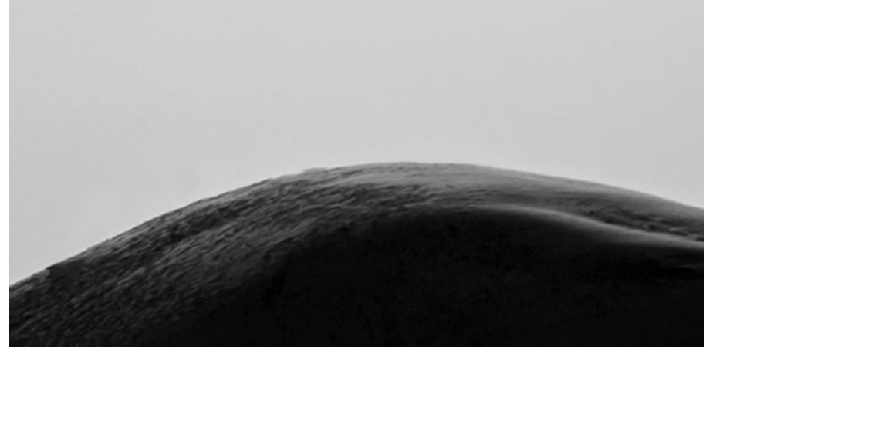
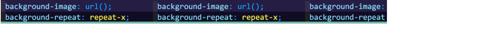

# CSS常用属性

## 字体

### 字体属性

设置字体属性使用`font-family`，它的属性值可以设置多个，字体具体显示出的样式取决于本地是否有设置的字体属性值和字体属性值的先后顺序，最先设置的属性值并且本地主机也安装了的将会被设置成字体样式。

```html
<div class="text1">Hello</div>
```

```css
.text1{
  font-family: serif;
}
```


常用的英文字体有`serif`衬线字体，`sans-serif`非衬线字体，`monospace`等宽字体，常用的中文字体有`宋体`、`微软雅黑`等。

如果不设置该属性，字体将使用主机默认字体。

### 字体大小

字体大小由`font-size`控制，字体大小默认是`16px`，可以设置成以`px`为单位的绝对值大小，也可以设置成百分比形式的相对于默认字体的大小，还可以使用`large`、`medium`、`small`这样的大小。字体大小的单位还可以是`em`，它是相对字体大小，`1em`等同于1默认字体大小，如果默认字体大小被修改，`em`的大小也就不一样，与之相似的是`rem`，它取决于根字体的大小。

```html
<div class="text2">World</div>
```

```css
.text2{
    font-family: sans-serif;
    font-size: medium;
}
```


### 字体样式

可以用`font-style`为字体设置斜体样式，属性值为`italic`即斜体样式。

```html
<div class="text3">你好</div>
```

```css
.text3{
    font-style: italic;
    font-family: songti;
}
```


### 字体粗细

字体粗细通过`font-weight`来控制，属性值为`bold`显示粗体，也可以通过数值`100、200、300...`来控制，其中数值`700`对应粗体`bold`。

```html
<div class="text4">世界</div>
```

```css
.text4{
    font-family: Georgia, 'Times New Roman', Times, serif;
    font-weight: bold;
}
```


### 属性简写

以上四种属性其实可以写进一个属性`font`里，它是这些属性的简写方式，属性值以空格分隔，`font`的属性值顺序有明确规定，必须要按以下顺序来设置：

* font-style
* font-variant
* font-weight
* font-size/line-height
* font-family

属性值不写是会按照默认值自动填充的。

```html
<div class="text5">Hello World</div>
```

```css
.text5{
  font:italic bold 2rem sans-serif;
}
```


## 文本

### 文本颜色

文本颜色由属性`color`控制，属性值可以是十六进制表示的颜色，rgb属性值，或者常用的颜色英文属性值。

```html
<div class="text1">Lorem ipsum dolor sit amet consectetur adipisicing elit. 
  Nam odit sint rem incidunt praesentium 
  perferendis dignissimos vel amet delectus! Veniam, voluptatum nobis! 
  Perferendis natus dolorum eligendi nemo necessitatibus sunt cumque.
</div>
```

```css
.text1{
    color: red;
    color: #f12a2a;
    color: rgb(252, 0, 0);
}
```


### 文本行高

文本行高使用`line-height`控制，属性值可以是以`px`为单位的绝对值。

```html
<div class="text2">Lorem ipsum dolor sit amet, 
  consectetur adipisicing elit. Voluptatum ipsum maiores dolor excepturi cum quia fugit, vel repellendus, asperiores quas rerum omnis 
  nobis sit similique aliquid quos earum at animi?
</div>
```

```css
.text2{
    line-height: 50px;
}
```


### 文本对齐方式

文本对齐方式的设置通过`text-align`来实现，属性值可以是`right`、`center`、`left`三者之一。

```html
<div class="text4">Lorem ipsum dolor sit amet consectetur adipisicing elit. Mollitia soluta eligendi modi exercitationem quia totam. Dolores fuga consequatur similique. In veniam consequatur tenetur officiis quasi amet expedita quas sit exercitationem.</div>
```

```css
.text4{
    text-align: right;
}
```


### 方向

使用`direction`来控制文本方向，方向可以是从左至右`ltr`，或者相反从右至左`rtl`，它并不改变英文单词书写顺序，只是改变标点顺序。

```html
<div class="text5">a_b_c, Hello World!</div>
<div class="text6">a_b_c, Hello World!</div>
```

```css
.text5{
    direction: rtl;
}

.text6{
    direction: ltr;
}
```


### 缩进

控制文本的首行缩进用`text-indent`属性，默认值为0，可以用长度值或者百分比大小让它缩进。

```html
<div class="text7">Lorem ipsum dolor sit amet consectetur adipisicing elit. Pariatur ipsa unde architecto sed, porro eveniet ad aut accusantium corporis! Minus, aliquam iure sint nisi at commodi nesciunt quae aperiam illum!</div>
```

```css
.text7{
    text-indent: 1em;
}
```


### 装饰线

使用`text-decoration`属性来使文本拥有装饰线效果，

```html
<div class="text8">Hello World</div>
<div class="text9">Hello World</div>
<div class="text10">Hello World</div>
```

```css
/* 上横线 */
.text8{
    text-decoration: overline;
}

/* 下划线 */
.text9{
    text-decoration: underline;
}

/* 删除线 */
.text10{
    text-decoration: line-through;
}
```


### 文字间隔

使用`letter-spacing`属性控制文字字符间隔大小，间隔大小可以是负值。

```html
<div class="text11">Lorem ipsum dolor sit amet consectetur adipisicing elit. Incidunt reiciendis natus inventore. Ea minus quae laborum optio reprehenderit quis est nemo culpa tempora rerum quos, deserunt unde placeat. Et, inventore.</div>
```

```css
.text11{
    letter-spacing: 2rem;
}
```


### 文字阴影

使用`text-shadow`属性来控制文本阴影。语法格式：

```css
text-shadow: X轴偏移量+Y轴偏移量+高斯模糊距离+颜色值;
```

例：

```html
<div class="text12">Hello World</div>
```

```css
.text12{
    text-shadow: 10px 12px 5px red;
}
```


## 尺寸

### 宽度与高度

宽度与高度是CSS最常用的属性之一，它们可以更改元素的长度与宽度。HTML元素自身的高度与宽度往往由内部元素决定，比如说`<div>Hello</div>`，能够使`div`元素拥有高度与宽度的原因在于它内部包含的文本让`div`被撑了起来。但是一些元素并不能通过`height`更改高度，这些元素大部分是内联元素（或称作行内元素），这在之后的章节会介绍到。

我们可以给图片元素`img`设置相应的`width`、`height`改变它的原始大小。

给文本设置`width`和`height`可以控制文本的长度，一般来说文本超过宽度会折行，但是如果还设置了文本的高度并且文本超过了这个设置的高度，文本并不会有什么变化，但是如果还设置了`overflow: hidden;`，那么超过这个设置的区域的文本会被隐藏。

```html
<div class="text3">Lorem ipsum dolor sit amet consectetur adipisicing elit. Maxime ipsam minima obcaecati nihil fugiat, repellendus est excepturi quaerat quam ad tempora numquam exercitationem voluptates similique rem nemo ratione sint ipsa?</div>
```

```css
.text3{
    width: 200px;
    height: 200px;
    overflow: hidden;
}
```


### 最小/最大宽度/高度

在一个网页中，如果给图片大小`width`和`height`设定百分比的大小，那么它会随父元素（或者就是网页视口大小）的变大而变大，变小而变小，当不希望随视口一直变小而变小时，就可以设定`min-width`或者`min-height`，有了这个最小大小，就能确保元素最小不能小于这个指定的值。

同样的，`max-height`与`min-width`也是同样的道理，它指定元素最大不能大于指定的值。

## 列表属性

### list-style-image

`list-style-image`可以通过设置属性值`url()`为列表每一项前设置一个图片，默认是`none`，即没有之意。例：

```html
<ul class="list1">
  <li>列表1</li>
  <li>列表2</li>
  <li>列表3</li>
  <li>列表4</li>
  <li>列表5</li>
</ul>
```

```css
.list1{
  list-style-image: url(./img/list.png);
}
```



### list-style-position

`list-style-position`用于在什么位置显示列表前的标记，默认属性值为`outside`，可以设置成`inside`。

```html
<ul class="list2">
  <li>列表1</li>
  <li>列表2</li>
  <li>列表3</li>
  <li>列表4</li>
  <li>列表5</li>
</ul>
```

```css
.list2{
    list-style-position:inside;
}
```



### list-style-type

`list-style-type`用于设置列表前每一项目的符号类型，默认属性值是`disc`。属性值可以设置成`none`，不显示列表项目符号。属性值也可以设置成`circle`、`square`等其它类型。

```html
<ul class="list3">
  <li>列表1</li>
  <li>列表2</li>
  <li>列表3</li>
  <li>列表4</li>
  <li>列表5</li>
</ul>
```

```css
.list3{
    list-style-type: square;
}
```



### 简写属性

`list-style`是一个简写属性，它相当于`list-style-image + list-style-position + list-style-type`，与`font`简写属性一样，它允许省略其中几个属性值不写，但是它允许以任意顺序写这些属性值。

## 背景

### 背景颜色

`backgoround-color`用来控制元素的背景颜色，例：

```html
<div class="bgc"></div>
```

```css
.bgc{
    width: 100px;
    height: 100px;

    background-color: rgb(255,0,0);
}
```



背景颜色的属性值可以是十六进制、可以是rgb属性值，也可以是具体颜色值。

### 背景图像

背景图像是由`background-image`来控制的，属性值是一个`url()`值。例：

```html
<div class="bgi"></div>
```

```css
.bgi{
    width:600px;
    height: 300px;

    background-image: url(./../img/bgi.png);
}
```



### 背景图片的重复

`background-repeat`属性用来控制背景图片是否重复，与`background-repeat`配合使用，当背景图片宽高小于元素的宽高时，就会发生重复平铺现象。

```html
<div class="bgi2"></div>
```

```css
.bgi2{
    width: 1000px;
    height: 100px;

    background-image: url(./../img/bgi2.png);
    background-repeat: repeat-x;
}
```



如果不特意指定该属性，那么背景图片将会在x轴与y轴方向同时重复。属性值设定为`no-repeat`时，则不会发生重复；设定为`repeat-x`时，则只会在x轴方向重复；设定为`repeat-y`时，则只会在y轴方向上重复。

### background-position

