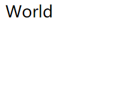

# CSS常用属性

## 字体

### 字体属性

设置字体属性使用`font-family`，它的属性值可以设置多个，字体具体显示出的样式取决于本地是否有设置的字体属性值和字体属性值的先后顺序，最先设置的属性值并且本地主机也安装了的将会被设置成字体样式。

```html
<div class="text1">Hello</div>
```

```css
.text1{
  font-family: serif;
}
```


常用的英文字体有`serif`衬线字体，`sans-serif`非衬线字体，`monospace`等宽字体，常用的中文字体有`宋体`、`微软雅黑`等。

如果不设置该属性，字体将使用主机默认字体。

### 字体大小

字体大小由`font-size`控制，字体大小默认是`16px`，可以设置成以`px`为单位的绝对值大小，也可以设置成百分比形式的相对于默认字体的大小，还可以使用`large`、`medium`、`small`这样的大小。

```html
<div class="text2">World</div>
```

```css
.text2{
    font-family: sans-serif;
    font-size: medium;
}
```



### 字体样式

可以用`font-style`为字体设置斜体样式，属性值为`italic`即斜体样式。

```html
<div class="text3">你好</div>
```

```css
.text3{
    font-style: italic;
    font-family: songti;
}
```


### 字体粗细

字体粗细通过`font-weight`来控制，属性值为`bold`显示粗体，也可以通过数值`100、200、300...`来控制，其中数值`700`对应粗体`bold`。

```html
<div class="text4">世界</div>
```

```css
.text4{
    font-family: Georgia, 'Times New Roman', Times, serif;
    font-weight: bold;
}
```


### 属性简写

以上四种属性其实可以写进一个属性`font`里，它是这些属性的简写方式，属性值以空格分隔，`font`的属性值顺序有明确规定，必须要按以下顺序来设置：

* font-style
* font-variant
* font-weight
* font-size/line-height
* font-family

属性值不写是会按照默认值自动填充的。

```html
<div class="text5">Hello World</div>
```

```css
.text5{
  font:italic bold 2rem sans-serif;
}
```


## 文本

### 文本颜色

文本颜色由属性`color`控制，属性值可以是十六进制表示的颜色，rgb属性值，或者常用的颜色英文属性值。

```html
<div class="text1">Lorem ipsum dolor sit amet consectetur adipisicing elit. 
  Nam odit sint rem incidunt praesentium 
  perferendis dignissimos vel amet delectus! Veniam, voluptatum nobis! 
  Perferendis natus dolorum eligendi nemo necessitatibus sunt cumque.
</div>
```

```css
.text1{
    color: red;
    color: #f12a2a;
    color: rgb(252, 0, 0);
}
```


### 文本行高

文本行高使用`line-height`控制，属性值可以是以`px`为单位的绝对值。

```html
<div class="text2">Lorem ipsum dolor sit amet, 
  consectetur adipisicing elit. Voluptatum ipsum maiores dolor excepturi cum quia fugit, vel repellendus, asperiores quas rerum omnis 
  nobis sit similique aliquid quos earum at animi?
</div>
```

```css
.text2{
    line-height: 50px;
}
```


### 文本对齐方式

文本对齐方式的设置通过`text-align`来实现，属性值可以是`right`、`center`、`left`三者之一。

```html
<div class="text4">Lorem ipsum dolor sit amet consectetur adipisicing elit. Mollitia soluta eligendi modi exercitationem quia totam. Dolores fuga consequatur similique. In veniam consequatur tenetur officiis quasi amet expedita quas sit exercitationem.</div>
```

```css
.text4{
    text-align: right;
}
```


### 方向

使用`direction`来控制文本方向，方向可以是从左至右`ltr`，或者相反从右至左`rtl`，它并不改变英文单词书写顺序，只是改变标点顺序。

```html
<div class="text5">a_b_c, Hello World!</div>
<div class="text6">a_b_c, Hello World!</div>
```

```css
.text5{
    direction: rtl;
}

.text6{
    direction: ltr;
}
```


## 尺寸

### 宽度

给文本设置`width`和`height`可以控制文本的长度，一般来说文本超过宽度会折行，但是如果还设置了文本的高度并且文本超过了这个设置的高度，文本并不会有什么变化，但是如果还设置了`overflow: hidden;`，那么超过这个设置的区域的文本会被隐藏。

```html
<div class="text3">Lorem ipsum dolor sit amet consectetur adipisicing elit. Maxime ipsam minima obcaecati nihil fugiat, repellendus est excepturi quaerat quam ad tempora numquam exercitationem voluptates similique rem nemo ratione sint ipsa?</div>
```

```css
.text3{
    width: 200px;
    height: 200px;
    overflow: hidden;
}
```


### 最小