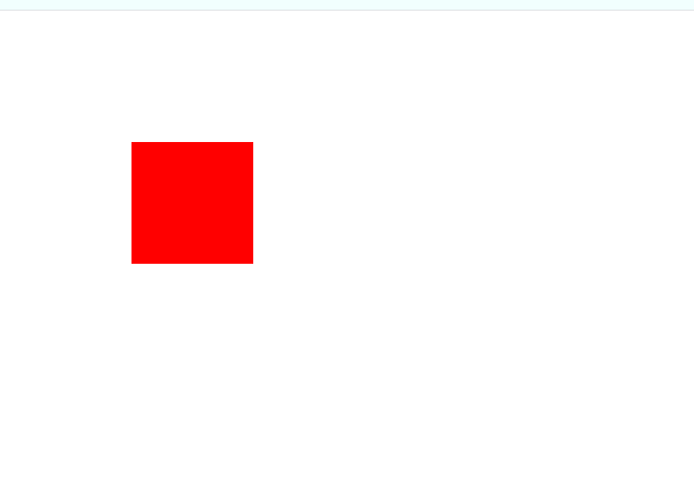
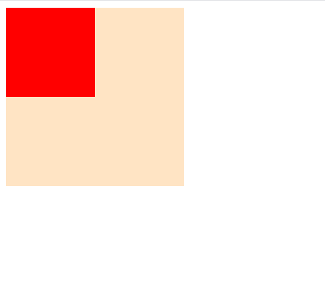
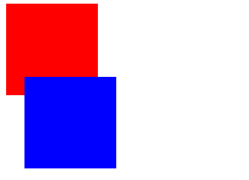
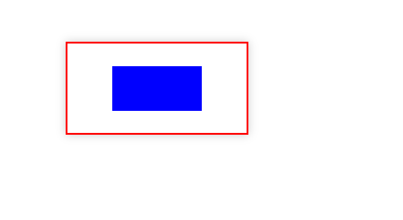

# 定位属性

定位属性用来控制元素在页面中的位置，定位属性通过`position`来进行设置，`position`的属性值有`static`、`relative`、`fixed`、`absolute`，默认是`static`表示标准文档流。

## 定位位置

在使用`position`后（默认值`static`不拥有控制元素偏移的效果），就可以通过`top`、`bottom`、`left`、`right`来分别控制上下左右四个方向的偏移值。通过偏移值的设置可以控制元素的移动。

```html
<div class="box"></div>
```

```css
.box{
    background-color: red;
    width: 100px;
    height: 100px;

    position: relative;

    top: 100px;
    left: 100px;
}
```



偏移量允许是负值，表示反方向的偏移。

## 层级

层级这个概念在制作PPT就能常常能被体现，比如制作PPT时图片的上移一层或者下移一层就是一个层级的体现。在CSS中有元素`z-index`可以控制元素的层级，通过`z-index`能让图片覆盖另一张图片。

```html
<div class="box1"></div>
<div class="box2"></div>
```

```css
.box1{
    width: 200px;
    height: 200px;
    background-color: bisque;
    position: absolute;
    z-index: 9;
}

.box2{
    width: 100px;
    height: 100px;
    background-color: red;
    position: absolute;
    z-index: 90;
}
```



`z-index`只会在`position: absolute;`时发挥作用，`z-index`的值设置的值越大表示层级越大，层级大的元素显示在最上层。

## 相对定位

相对定位通过设置`position: relative;`实现，它表示元素相对于正常文本流中的位置变化。相对定位不会使元素脱离正常文档流，也不会影响其它元素的位置。

```css
.box1{
    width: 100px;
    height: 100px;
    background-color: red;
}

.box2{
    width: 100px;
    height: 100px;
    background-color: blue;
    position: relative;
    left: 20px;
    top: -20px;
}
```



## 绝对定位

为元素设置`position: absolute;`表示绝对定位，绝对定位使元素脱离了正常文档流，如果父元素设定了`position: relative;`，那么元素相对于父元素进行偏移，如果父元素没有设置那么该元素将相对于整个页面的视口进行偏移。这个属性能配合之前的`z-index`使用。

`position: fixed;`也是绝对定位，它使元素相对于页面的视口进行偏移。

我们通过定位的方式为父元素的子元素相对于父元素进行居中定位。例：

```css
.main {
  width: 200px;
  height: 100px;
  border: 2px red solid;
  box-shadow: 0 0 10px #ccc;
  position: relative;
  left: 100px;
  top: 100px;
}
.main div {
  position: absolute;
  background-color: blue;
  left: 25%;
  top: 25%;
  right: 25%;
  bottom: 25%;
}
```


