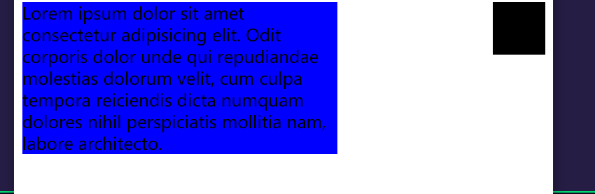
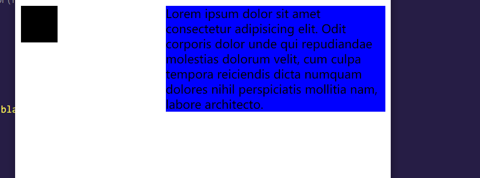
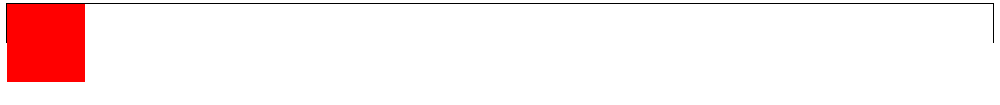
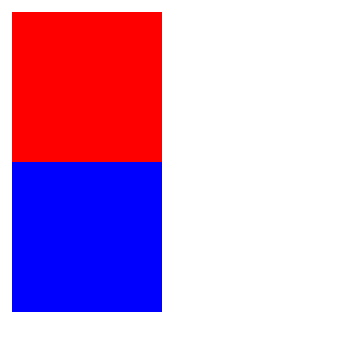
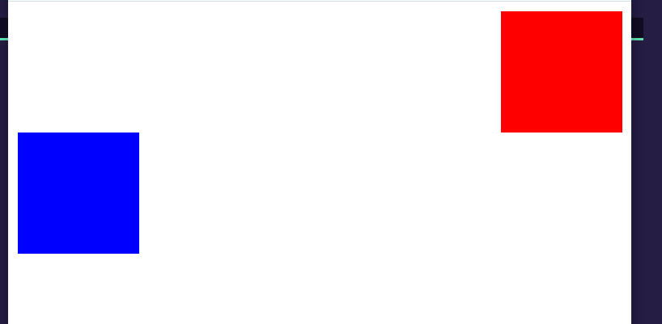
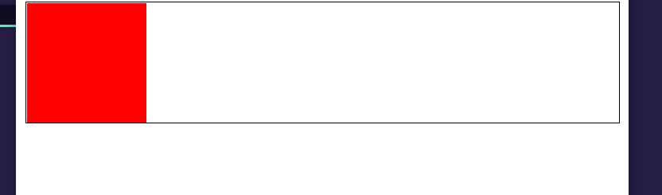

# 浮动布局

## 浮动的含义

浮动是指让元素脱离文档流向左或向右布局，通过`float`属性进行元素的浮动布局，属性值默认为`none`不浮动；可以设置为`left`，表示左浮动；或者设置为`right`，表示右浮动；亦或者`both`表示两侧浮动。

```html
<div class="box1 box"></div>
<div class="box2 box"></div>
```  

```css
.box{
    width: 50px;
    height: 50px;
}

.box1{
    float: left;

    background-color: black;
}

.box2{
    margin-left: 100px;

    background-color: blue;
}
```


如上述结果所示，为`box1`设置`float: left;`后，这个元素从左侧开始均脱离文档流，相邻元素占据它的左上角位置，相邻元素内部的文本内容感受到`box1`的存在会避开`box1`。

但是如果我们把`box1`的`float`属性值设置为`right`时，运行结果为：



可以看到`box1`占据了浏览器视口的右侧位置。

`float`属性的功能在于指定一个元素应沿其容器的左侧或右侧放置，`box1`的容器是`body`元素，所以它会占据视口的左侧或右侧，但是需要注意的是此时设定`float`属性的元素会从文档流中脱离出去，但是依然会被文本内容感应到，所以这种特性被运用于图文混排。

## 左右浮动与盒边界

`box-sizing`属性允许您以特定的方式定义匹配某个区域的特定元素。  

例如，假如您需要并排放置两个带边框的框，可通过将 `box-sizing` 设置为 `"border-box"`。这可令浏览器呈现出带有指定宽度和高度的框，并把边框和内边距放入框中。

关于`box-sizing`属性的说明，详情请看[学会使用box-sizing布局](https://www.jianshu.com/p/e2eb0d8c9de6)这篇文章。  

将`float`设置在子元素中可以看到，`float`是相对于父元素进行占用空间的，如果在一个父元素中同时设置两个子元素，两个元素的`float`属性分别设置成`left`和`right`，可以看到两个元素自动分开，且中间自动留有空隙。 

```html
<div class="box1 box"></div>
<div class="box2 box">Lorem ipsum dolor sit amet consectetur adipisicing elit. Odit corporis dolor unde qui repudiandae molestias dolorum velit, cum culpa tempora reiciendis dicta numquam dolores nihil perspiciatis mollitia nam, labore architecto.</div>
```

```css
.box{
    width: 50px;
    height: 50px;
}

.box1{
    float: left;
    background-color: black;
}

.box2{
    width: 300px;
    height: auto;
    background-color: blue;
    float: right;
}
```



## 文档流脱离

为一个元素设定`float`（属性值不为`none`的情况下）意味着它会脱离正常的文本流。在之前的内容中，我们了解了在不为块级父元素设置高度时，它的高度将由子元素内容决定，但是在子元素脱离正常文档流后，意味着父元素的高度无法由子元素决定。

```html
<div class="box-out">
    <div class="box-in"></div>
</div>
```

```css
.box-out{
    height: 50px;
    border: 1px solid black;
}

.box-in{
    width: 100px;
    height: 100px;
    background-color: red;

    float: left;
}
```



## 清除浮动

为设置浮动的元素的下一个相邻元素设置`clear`属性即可清除设置浮动元素的影响，属性值可以是`left`、`right`,或`both`。

```html
<div class="box1"></div>
<div class="box2"></div>
```

```css
.box1{
    width: 100px;
    height: 100px;
    background-color: red;
    float: left;
}

.box2{
    width: 100px;
    height: 100px;

    background-color: blue;
    clear: left;
}
```



`clear`的属性值的设定往往与上一元素设置的`float`值一致。

另外`clear`只是消除上一元素`float`对这一元素的影响，如果上一元素设置的是`float: right;`，那么它依然会占据浏览器视口右侧位置，只不过设置了`clear: right;`的元素不会去占据丢失的左侧文档流位置。

```css
.box1{
    width: 100px;
    height: 100px;
    background-color: red;
    float: right;
}

.box2{
    width: 100px;
    height: 100px;

    background-color: blue;
    clear: right;
}
```



## 行内元素的`float`设置

在行内元素的css样式中设置`float`属性，会使行内元素转变成块级元素，从而使行内元素能够设置宽度与高度。（行内元素原始设置宽高是无效的）  

## 消除浮动对父元素的影响

### clearfix清除对父元素的影响  

前面我们知道，子元素设置了`float`属性时，即使父元素不设置确切高度值，子元素也是无法将父元素撑开的，此时我们在父元素中再添加一个子元素，这个子元素不设置`float`，这个子元素就能将父元素撑开，如果不希望看到这个子元素，就无需为它设置样式，这样它就能不显示在屏幕上。

```html
  <div class="box-out">
    <div class="box-in1"></div>
    <div class="box-in2"></div>
  </div>
```

```css
.box-out{
    border: 1px solid black;
}

.box-in1{
    width: 100px;
    height: 100px;
    background-color: red;
    float: left;
}

.box-in2{
    clear: left;
}
```



### 伪元素清除浮动对父元素的影响 

伪元素`::before`可以为已选中的元素添加一个默认为行内元素的子元素，且子元素会被设置成已选元素的第一个子元素，同样的，`::after`可以为已选元素添加一个子元素，该子元素会被设置成已选元素的最后一个子元素。该属性必须要添加`content:"文本内容"`以显示出添加元素中想要显示的文本内容，不过可以将文本内容设置为空，这样就不会显示出文本内容。  

我们可以为HTML元素自定义属性，在自定义的属性名前添加`data-`以表示该属性是自定义的，我们可以这样设置`content:attr(自定义属性)`，此时`content`的内容就是自定义属性内容，例如：

```html  
<style>p::{
  content:attr(data-name);
}
</style>
<p data-name:"name"></p>
```

此时`p`元素后就能显示出新添加的`content`，即`name`。  

通过"`clearfix`清除对父元素的影响"这部分内容，我们知道要清除浮动无法使子元素撑开父元素的影响，可以为父元素添加再添加一个未设置`float`的子元素就可以了，我们就可以为父元素添加`::after`伪元素，这个伪元素无需设置`content`，只需要将其`display`设置成`block`使其从行内元素变为块级元素就可以了。

```html
<div class="box-out">
    <div class="box-in"></div>
</div>
```

```css
.box-out{
    border: 1px solid black;
}

.box-in{
    width: 100px;
    height: 100px;

    background-color: blue;
}

.box-in::after{
    content: none;
    display: block;
}
```


### `overflow`消除浮动对父元素的影响  

为父元素设置一个`overflow:hidden`或者`overflow:auto`都能消除浮动对父元素的影响，使子元素能够撑开没有设置高度的父元素。
