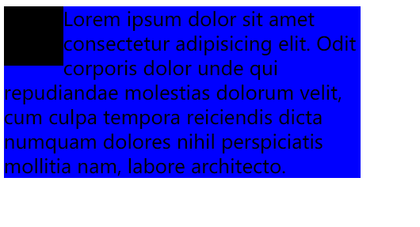

# 浮动布局

## 浮动的含义

浮动是指让元素脱离文档流向左或向右布局，通过`float`属性进行元素的浮动布局，属性值默认为`none`不浮动；可以设置为`left`，表示左浮动；或者设置为`right`，表示右浮动。

```html
<div class="box1 box"></div>
<div class="box2 box"></div>
```  

```css
.box{
    width: 50px;
    height: 50px;
}

.box1{
    float: left;

    background-color: black;
}

.box2{
    margin-left: 100px;

    background-color: blue;
}
```



