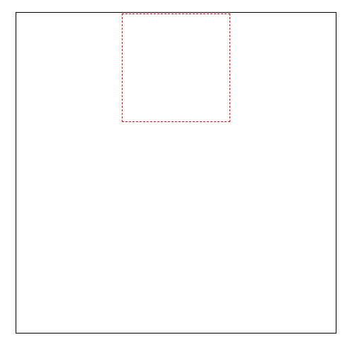
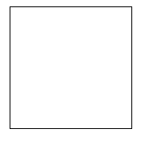
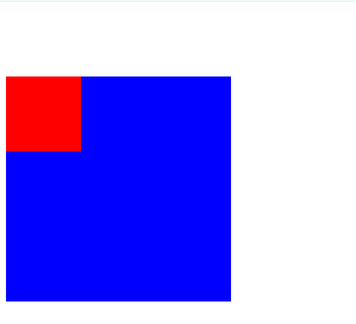

# 盒模型

之前我们就已经提到相关盒子模型的概念了，我们可以把每一个html元素都看成是一个盒子，这个盒子有外边距`margin`、内边距`padding`、内容`content`三部分，除此之外还有盒子的边框属性`border`。


## 外边距

盒子模型的外边距属性是`margin`，它可以分别用上边距`margin-top`、`margin-right`右边距、`margin-bottom`下边距、`margin-right`右边距表示四条边的边距。所谓的边距就是两个元素之间的距离，一般来说设置的两个盒子都是紧挨在一起的，用外边距就可以使这两个盒子分离开。

例，以下有两个图片元素，如果不设置外边距属性，它们是挨在一起的（图片元素属于`inline-block`元素，它们并不是块级元素，所以不会像块级元素一样紧挨在一起）：

```html


```


给蓝色图片设置一个外边距后：

```css
img[alt="blue"]{
    margin: 20px;
}
```


外边距的属性值可以是绝对值px一类的属性值，也可以是百分比、`em`一类的相对属性。

现在我们可以使用`margin`让一个元素中的子元素居中对齐（默认是左对齐）：

```html
  <div class="box2">
    <div class="box3"></div>
  </div>
```

```css
.box2{
    margin: 20px;
    width: 300px;
    height: 300px;
    border: 1px solid black;
}

.box3{
    width: 100px;
    height: 100px;
    border: 1px dashed red;
    margin: 0 auto;
}
```



做法是将子元素的`margin`属性值设置为`0 auto`，`auto`表示自动调整，上下外边距被设置成了0（实际上还可以是其它值）。

另外需要注意的是，如果同时设置了上下外边距，系统将只会选择其中的一个外边距（如果两者的外边距有冲突），左右外边距也是一样，规则是左右同时设置发生冲突时选左边距，上下边距发生冲突时选上边距，一般会发生冲突的情况是子元素在父元素内容设置外边距时。

## 边框属性

`margin`所表示的外边距是边框外的距离，可以使用这个属性勾勒出元素的轮廓，它有以下几个常用的样式：

* 边框样式`border-style`
* 边框粗细`border-width`
* 边框颜色`border-color`

这三个属性可以合并写成一个简写属性`border`，简写属性的属性值没有特定的顺序。

例，显示一个高宽100px元素的黑色边框：

```html
<div class="box1"></div>
```

```css
.box1{
    width: 100px;
    height: 100px;

    border: 1px solid black;
}
```



对于一个元素来说默认情况下是不显示它的边框的，所以对一个元素边框来说，它的边框粗细、边框样式和边框颜色的属性缺一不可。

边框样式`border-style`的属性值除了`solid`显示直线边框外，还有`dotted`圆点状边框，`dashed`短的方形虚线，`double`双实线等属性值。

## 内边距

内边距`padding`是元素从边框到内容`content`的距离，它的属性值与`margin`一致，像是`img`一类的元素，就可以设置内边距，让图片内容与边框有一定的距离。

## 块级元素与行内元素

1. 块级元素，块级元素默认占一行，一行内添加一个块级元素后，无法再添加其它元素，例`div`、`p`、`h1`~`h6`、`ul`等。

2. 行内元素，行内元素在一条直线上排列（默认宽度只与内容有关），水平方向排列，例`a`、`span`等。

实际上一个元素是可以通过`display`属性来修改它们的元素属性的，比如说`div{ display: inline; }`，就能将块级元素`div`修改成行内元素。

行内元素与块级元素的元素属性不同，块级元素的宽高、行高以及外边距和内边距都是可控的。行内元素设置`width`无效，`height`无效（可以设置`line-height`），`margin`和`padding`上下无效。

### 行内块元素

行内块元素是比较特殊的一类元素，它的`display`属性值是`inline-block`。`inline-block`将对象呈现为`inline`对象，但是对象的内容作为`block`对象呈现。之后的内联对象会被排列在同一行内。比如我们可以给一个`link`（`a`元素）`inline-block`属性值，使其既具有`block`的宽度高度特性又具有`inline`的同行特性。

常见的行内块元素有`img`、`input`元素等。

### 案例，外边距重叠效果

如果给一个块级元素内的块级子元素设置一个`margin-top: 100px;`，那么父元素与子元素会同时下移100px，但是奇怪的是这个属性值的设置按照我们的思维来说应该是子元素在父元素内部下移的，而不是父元素与子元素同时下移。

```html
  <div class="box">
    <div class="in-box"></div>
  </div>
```

```css
.box {
    background-color: blue;
    width: 300px;
    height: 300px;
}

.in-box {
    margin-top: 100px;
    /*此时父级元素与此元素同时下移100px*/
    background-color: red;
    width: 100px;
    height: 100px;
}
```



处理这种问题以下三种方式均可以使用：

1. 父元素设置溢出隐藏：`overflow:hidden`
2. 给父元素设置内边距，即使只有`1px`
3. 给父元素设置边框。

另外注意这种效果只会发生在块级元素上，对`inline`和`inline-block`元素均不起效果，引起它的原因在于没有内容将块级父元素与块级子元素分隔开，只需要添加个内容就可以做到。