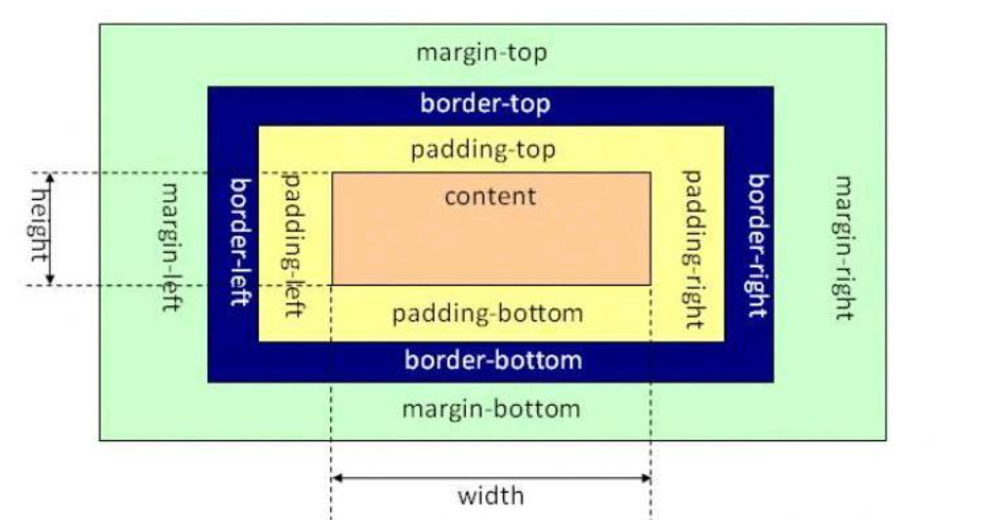
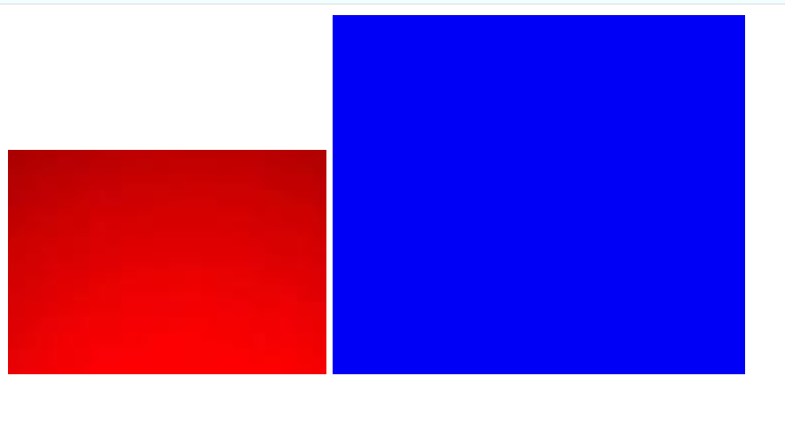

# 盒模型

之前我们就已经提到相关盒子模型的概念了，我们可以把每一个html元素都看成是一个盒子，这个盒子有外边距`margin`、内边距`padding`、内容`content`三部分，除此之外还有盒子的边框属性`border`。



## 外边距

盒子模型的外边距属性是`margin`，它可以分别用上边距`margin-top`、`margin-right`右边距、`margin-bottom`下边距、`margin-right`右边距表示四条边的边距。所谓的边距就是两个元素之间的距离，一般来说设置的两个盒子都是紧挨在一起的，用外边距就可以使这两个盒子分离开。

例，以下有两个图片元素，如果不设置外边距属性，它们是挨在一起的（图片元素属于`inline-block`元素，它们并不是块级元素，所以不会像块级元素一样紧挨在一起）：

```html


```



给蓝色图片设置一个外边距后：

```css
img[alt="blue"]{
    margin: 20px;
}
```


外边距的属性值可以是绝对值px一类的属性值，也可以是百分比、`em`一类的相对属性。

