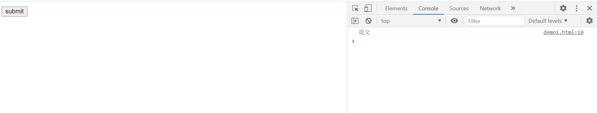

# JS 初识

## JS简述

布兰登·艾奇（ Brendan Eich ）在1995年利用十天时间完成 JavaScript 的设计。它最初被命名为 LiveScript ，开始设计出来是为了网页的交互设计的，后来 Sun 公司为了辅助 Java 语言的网页功能设计，也参与了 LiveScript 的发展，并将其改名为 JavaScript。

虽然 JavaScript 在语法上有点类似 Java ，但它与 Java 却是两种不同的语言。Script 意为脚本，顾名思义 JavaScript 是一种脚本语言，并不需要被编译就可以运行在编译器内（然而现在的 JavaScript 可以被即时编译，但它仍然是解释语言）。它也在不断的发展中拥有了更加强大的功能，例如凭借 node.js 可以进行服务器端的开发，能够进行桌面软件开发等。

## 浏览器执行 JS 过程简介

浏览器分为两部分：渲染引擎和 JS 引擎：

* 渲染引擎：用来解析 HTML 和 CSS ，俗称内核。
* JS 引擎：也被称为 JS 解释器，用来读取网页中的 JavaScript 代码，对其处理后运行，比如 chrome 浏览器的著名的 V8引擎。

## JS 的组成

JS 由 ECMScript （ JavaScript 语法）、 DOM （页面文档对象模型）、 BOM （浏览器对象模型）三部分组成。

### ECMAScript

ECMAScript 是由 ECMA 国际（原欧洲计算机制造商协会）进行标准化的一门编程语言，它往往被称为 JavaScript 或 JScript ，但实际上后两者是 ECMAScript 语言的实现和扩展。

### DOM

文档对象模型（Document Object Model，简称 DOM )，是 W3C组织推荐的可扩展标记语言的标准编程接口。通过 DOM 提供的接口可以对页面上的各种元素进行操作（大小、位置、颜色等）。

### BOM

BOM （Browser Object Model, 简称 BOM ）是指浏览器对象模型，它提供了可以与浏览器窗口进行互动的对象结构，通过 BOM 可以操作浏览器窗口，比如弹出框、获取分辨率等。

## JS 书写位置

JS 与 CSS 的书写位置相似分为行内式、内嵌式与外部引入式。

### 行内式

行内式可以直接写进 HTML 的元素内部，例：

```html
<!DOCTYPE html>
<html lang="en">
<head>
  <meta charset="UTF-8">
  <meta name="viewport" content="width=device-width, initial-scale=1.0">
  <title>Document</title>
</head>
<body>
  <div>
    <button onclick="console.log('提交')">submit</button>
  </div>
</body>
</html>
```

此时用浏览器打开这个写好的页面，浏览器上会有一个按钮，按 F12 后打开浏览器控制台，只要鼠标点击按钮，控制台就会出现“提交”字样。



### 内嵌式

内嵌式是将 JS 内容写入 HTML 的`head`元素的`<script></script>`标签内。例：

```html
<!DOCTYPE html>
<html lang="en">
<head>
  <meta charset="UTF-8">
  <meta name="viewport" content="width=device-width, initial-scale=1.0">
  <title>Document</title>
  <script>
    console.log("内嵌式");
  </script>
</head>
<body>
  
</body>
</html>
```

### 外部引入式

外部引入式就是将 JS 代码保存为后缀是`.js`的文件，通过`<script></script>`元素的`src`属性进行引入。

```html
<head>
  <script src="./js/demo.js"></script>
</head>
```

## JS 注释

JS 注释分为单行注释与多行注释，被注释的内容不会被执行。

1. 单行注释使用`//`，只需要将注释内容写在双斜杠后面就可以被注释了。
2. 多行注释是将多行需要注释的内容写在`/*`与`*/`之间。

例：

```js
// 这是单行被注释内容

/*这是
多行
被注释
内容
*/
```

## 输入输出

JS 的输入可以使用`prompt`函数来进行，使用它会弹出一个输入框，用法示例：

```js
prompt("请输入您的内容");
```


在实际项目中使用通过 DOM 来获取输入，之后的内容会提到，

输出主要使用`console.log`函数在浏览器控制台上进行输出，或者使用`alert`函数，像`prompt`那样弹出一个窗口进行输出。

## 变量

变量用于存放数据。在我们写程序时，需要把数据传递给计算机，计算机根据我们提前声明的数据大小开辟一块存储位置用于存放数据，变量就是为这块存储位置起了个名字，然后我们要使用存储的数据时，就可以通过使用这块存储空间的名字找到数据了，这个存储空间的名字就是变量。

变量之所以称之为变量，是因为我们可以为变量自定义一个名字。

### 使用变量

在 JS 中，变量在使用前需要先声明，声明的格式为`var a`，`a`就是一个变量，当然它可以不叫`a`，可以使用别的字母替代。

我们要把数据给这个变量，就可以使用赋值号`=`，`=`在计算机高级语言中一般是被用为赋值的，而并不是等于号。我们要数字`3`赋值给变量`a`就可以写为`var a = 3;`。`;`表示一个语句的结束，要注意不要使用中文符号，JS　使用的符号是英文符号，使用中文符号就会报错，。`var a = 3`是边声明边赋值的语句，它被称作变量初始化，我们还可以先声明，再赋值，例：

```js
var a;
a = 3;
```

如上述所言变量`a`只是一块存储空间的名字，如果我们希望这块空间重新存储别的数据，就可以再次赋值，把原本的数据覆盖掉，例：

```js
var a;
a = 3;
a = 2;
console.log(a);
```

此时控制台输出变量`a`的结果是2。

两块不同的存储空间里的数据也可以相互赋值，例：

```js
var a;
a = 3;
var b;
b = 4;
a = b;
console.log(a);
```

此时输出变量`a`的结果是`4`，原本的数字3就被覆盖了。

### 命名规范

JS 的命名由字母（ A-Za-z ）、数字（ 0-9 ）、下划线（ _ ）、美元符号（ $ )组成，不能使用数字开头，

我们在命名变量时，应当注意变量内容是否符合它的含义，如：num 代表数字，

JS 是区分大小写的，所以要注意变量的大小写混用问题，

在我们的变量是由多个字母组成时，我们最好使用驼峰的命名的方式，即第一个单词的字母小写，其余单词第一个字母大写，如：userAge 就可以表示“使用者年龄”的含义，并且还符合驼峰的规范。

如果一个变量的内容我们始终都不需要改变它，那么它是算作“常量”的，它的变量名可以用全部大写以表示它是个不变的“常量”。

我们不能使用 JS 的一些关键字作为变量名称，例如`var`就是关键字。

## 数据类型

计算机在面对不同的数据类型的数据时，会给不同的数据类型划分不同的存储空间。在一些静态语言中，我们在声明不同的变量时，会用不同数据类型的变量声明符来声明数据，比如在C语言内，我们声明一个整数类型的数字，会使用`int`声明符，比如`int num = 3;`，在声明小数数据时，可以使用`float`或者`double`声明符。JS 是一个动态类型的计算机语言，我们初始化变量时，它会根据变量的内容来自动划分不同数据类型的储存空间，这意味着我们一个变量名是允许不同数据类型的数据不断覆盖的。

在C语言内，我们使用如下语句，

```c
int num = 3;
num = 3.4;
```

最终`num`的结果是会出现问题的，计算机存储`int`类型使用的存储空间在32位计算机下是4个字节，而小数默认是`double`类型则默认是8个字节的。`int`的空间大小装不下3.4的数据，就会发生小数截断现象，小数点后的数据都会被丢失。而在 JS 中使用，由`var`声明的变量就不必担忧不同数据类型的问题。

JS 可以把数据类型分为两类：

1. 简单数据类型
2. 复杂数据类型

简单数据类型包括 Number（数字型）、String （字符串）、 Boolean （布尔型）、 Undefined（未定义）、Null （空值）。

### Number 型数据

Number 包括整型和浮点型（就是小数）。

Number 型数据可以用不同类型的进制来表示，包括二进制、八进制、十进制，但是我们在使用`console.log()`输出时，会将不同进制的数据转换成十进制。

对于二进制，在 JS 中只需要在一个数字前加 0b 就可以表示二进制了。

对于八进制，我们在 JS 中只需要在一个数字前加 0 就可以表示八进制了。

对于十六进制，在 JS 中只需要在一个数字前加 0x 即能表示十六进制了。十六进制使用 a~f 表示 10~15。

Number 型数据最终是要存储在计算机中的，计算机分配的内存空间是有限的，我们可以使用`console.log(Number.MAX_VALUE);`打印输出 Number 能表示的数据的最大值，也可以使用`console.log(Number.MIN_VALUE);`打印输出 Number 能表示的数据的最小值。

在 JS 中，对于超过 Number 的`MAX_VALUE`的值用 Infinity 表示，对于小于 `MIN_VALUE`的值用 -Infinity 表示。

还有一种数据是 NaN，表示数据类型是非 Number 型的，在`console.log("hello" - 12);`中的输出结果就是 `NaN`，`"hello"`是一个字符串，不能与数字相减。

#### isNaN方法

`isNaN()`用来判读一个数据是否为 Number 型，如果是 Number 型的 ，就返回`false`，如果不是就返回`true`。

### String 字符串型

String 是字符串型的意思，我们把一段文字使用`""`双引号或者`''`单引号包裹起来的数据称为字符串，例如`console.log("hello world!");`会输出字符串`hello world!`，另外如果数字也用双引号或者单引号包裹起来，那么它就不是 Number 型的了。

#### 字符串嵌套

如果一句字符串中包含着双引号或者单引号，那么包裹它的就应该使用与字符串内部不同的引号，例如`"I'm`、`'you say "..."'`。

#### 字符串转义符

如果字符串想要换行，不能直接令字符串换行，

例：

```js
console.log("hello
world!");
```

上述案例中就是不允许的，但是我们可以使用转义符`\n`令它输出时进行换行，例：

```js
console.log("hello \nworld!");
```

除了`\n`具有换行的特殊含义外，还有`\t`表示制表符，`\\`表示斜杠（因为如果要使用`\`时，直接使用会与它的相邻字母构成转义符，所以需要使用`\\`表示普通的斜杠）等。

#### 获取字符串长度函数

可以使用`str.length`来获取一个字符串的长度，`str`代表那个字符串。例：

```js
var str = "hello world!";
console.log(str.length);
```

最终输出结果是12，显然字符串中间的空格也属于字符串的一部分，是要被计算在字符串长度中的。

#### 字符串拼接

对于字符串数据而言，使用`+`与字符串类型或者其它类型数据进行“运算”，其结果是这个字符串与另外一个字符串或者其它类型的数据拼接的结果。例：

```js
var str = "hello";
var num = 12;
console(num + str);
```

输出结果是`12hello`。

因为在字符串中，`+`的含义不再是加法运算，而是字符串拼接符，它的作用是把字符串进行拼接。如果把变量写进双引号内，它就不再是一个变量了，而是一个字符串，就像是双引号包裹的数字也不再是数字一样。

### boolean 布尔型数据

`boolean`布尔型数据只有`ture`与`false`，它就好比是开关的打开与关闭的状态，在之后的逻辑运算内容中，会重点提到`boolean`型数据。

在`boolean`型数据参与数学运算时，`ture`是被当作数字1来看的，`false`是被当作数字0来看的。

### undefined 与 null

如果一个变量声明了，但是没有被赋值，那么它就是未定义`undefined`。例：

```js
var a;
console.log(a);
```

输出的结果是`undefined`。

`null`在对象内容中会看到，它的含义是空值，我们可以为一个变量赋值为`null`，那么这个变量就开辟一片内存空间，但是这片空间里却没有存放任何数据。

### 类型检测

我们也可以使用`typeof`函数会返回数据的类型。例：

```js
var a;
console.log(typeof a);
a = 3;
console.log(typeof a);

a = null;
console.log(typeof a);
```

第一处输出是`undefined`，第二处输出是`number`，第三处输出是`object`对象。显然为变量赋值为`null`时，它会变成一个对象。

### 转换成 String 类型

我们可以使用`num.toString`函数将数字类型转换成字符串类型的数据。例：

```js
var b = 23;
console.log(typeof b.toString());
console.log(typeof b);
```

第一个输出是`string`，第二个是`number`，这意味着，它并不能真的改变变量的类型，只是返回一个新的类型的值而已。

我们可以利用字符串拼接，将数字类型与长度为0的字符串`""`拼接得到字符串类型。

### 转换成 Number 类型

之前我们说过，Number 类型有两种——整型和浮点型，相应的，将字符串转换成 Number 类型的函数也有两种`parseInt`函数和`parseFloat`函数，用法如下：

```js
var a = "12.3";
console.log(parseInt(a));
console.log(parseFloat(a));
```

第一个输出是`12`，因为`parseInt`函数返回的值是整数型的，小数点后的数据会丢失掉，那么第二个输出就是`12.3`。如果这个字符串中是用数字开头的，而数字后面则是其它字母，那么仅仅保留开头的数字，其余部分都会丢失掉，如果不以数字开头，那么这两个函数会返回`NaN`值。

字符串型的数字允许使用 - 、/ 、* 运算符隐式将它转换成数字。例：

```js
console.log(typeof ("123" * 1));
```

输出结果是 number 。

### 强制类型转换

我们可以使用类型名（`Boolean()`、`String()`、`Number()`）将数据强制转换成相应类型数据。

对于`null`，`Boolean(null)`的结果是`false`，对于非0的数字则会被`Boolean()`转换成`true`，而对于数字0则会被转换成`false`。

## 标识符、保留字、关键字

标识符：是指开发人员为变量、属性、函数、参数取的名字，标识符不能是关键字或保留字。

关键字：是指 JS 本身已经使用了的字，不能再用它们充当变量名、方法名。

保留字：是预留的“关键字”，意思是现在不是关键字，但是未来可能会成为关键字，同样不能使用它们当变量名或方法名。
