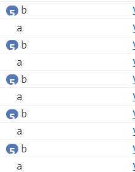

# 循环结构

循环结构是 JS 中非常重要的结构之一，通过循环结构，可以反复执行一段代码。

循环语句具有条件判断，用于什么条件下终止循环语句，要循环的那部分代码被称为循环体。

## for 循环

`for`循环语句是使用比较多的循环语句，它的语法格式为：

```js
for(初始化变量; 条件表达式; 操作表达式){
  循环体...
}
```

初始化变量用来给循环体计数，条件表达式用来决定什么时候终止循环，操作表达式用来更行初始化变量。用法实例：

```js
for(var i=0; i<5; i++){
  console.log("你好");
}
```

上述代码将输出5次“你好”，`i`在每次循环时就`+1`，直到等于5时不符合条件就终止了循环。

我们可以在`for`循环体内部再嵌套一个`for`循环为它执行一个多维度的循环。例：

```js
for(var a=0;a<5;a++){
  for(var b=0; b<5; b++){
    console.log("b");
  }
  console.log("a");
}
```

上述代码的执行结果是:



原因在于内部的`b`变量要执行5次，然而外部的`a`也要执行5次，`for`循环嵌套一个`for`循环的结果是先执行内部的`for`循环，然后又要执行外部的`for`循环，对于内部的循环5*5是25次，外部循环只有5次。

## while 循环

`while`循环的语法格式是：

```js
while(条件语句){
  循环体;
}
```

只要能满足条件语句就能去执行循环体里的语句，不过我们需要把更新计数器的语句也得写进循环体了，否则条件语句会一直成立。例：

```js
var a=0;
while(a<5){
  console.log(a);
  a++;
}
```

这将会输出0、1、2、3、4。当`a`等于5时已经不满足条件了，就会结束循环。

## do-while循环、

`do-while`循环与`while`类似，不过它先执行一次循环体里的内容，然后才会判断条件语句是否成立。例：

```js
var a=0;
do{
  console.log(a);
}while(a>0);
```

上述代码会输出一次0，然而`a=0`是不符合`a>0`的条件的，但它依然会执行一次循环体。

## continue 关键字

`continue`关键字用于跳出一次循环体，例：

```js
for(var a=0; a<5; a++){
  if(a===4){
    continue;
  }
  console.log(a);
}
```

除了`a`的值为4时会跳出一次循环导致无法输出`a`的值以外，其余`a`的值都能被输出。

## break 关键字

`break`关键字是中断循环，它与`continue`的区别在于，`continue`只会跳出当前的循环体，但循环依然会继续执行，而`break`则会直接结束循环。例：

```js
for(i=0;i<5;i++){
  console.log(a);
  break;
}
```

只会输出一次`a`的值为0的情况，其余情况都因为`break`关键字导致循环被中断了。
