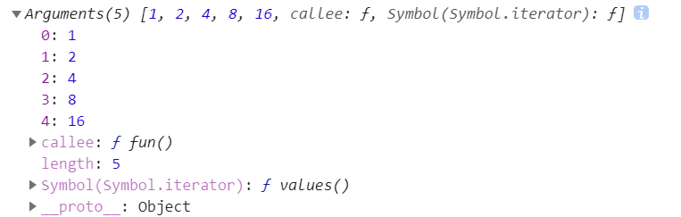
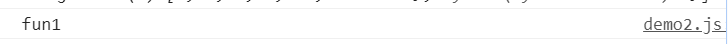

# 函数(2)

## arguments

当我们不确定有多少个参数传递时，可以用`arguments`来获取。`arguments`是当前函数的一个内置对象，所有函数都内置了一个`arguments`对象，`arguments`对象中存储了传递的所有实参。例：

```js
    function fun(){
      console.log(arguments);
    }
    var a=1;
    var b=2;
    var c=4;
    var d=8;
    var e=16;
    fun(a, b, c, d, e);
```

输出结果为：



如上所述，只要有参数传递进了函数中就会被存进`arguments`，但是这个`arguments`的数据类型不是数组，不能使用一些数组可以使用的方法，如`push`、`pop`，可以使用`length`，存储的数据也是以索引进行存储的。

## 函数中调用声明函数

函数是可以调用另一个函数的，这一点是显而易见的，毕竟`console.log`也是一个函数，不过在一个函数中也可以声明另一个函数，例：

```js
function fun1(){
  console.log("fun1");
  function fun2(){
    console.log("fun2");
  }
}

fun1() //输出 fun1
```



如上所示，我们在使用`fun1()`函数时，只输出了`fun1`的内容，没有输出`fun2`，是因为没有调用`fun2()`，只是声明了它。但是需要注意的是，只能在`fun1()`函数内部调用`fun2()`，如果在`fun1()`函数外部调用`fun2()`会出现 error，例：

```js
function fun1() {
  console.log("fun1");
  function fun2() {
    console.log("fun2");
  }
  fun2(); //当fun1()被执行时，fun2()才会被执行，输出 fun2
}

fun1(); //输出 fun1, fun2

fun2();//会发生错误 error
```

不要忘了之前所说的函数作用域，`fun2()`是在`fun1()`内部被声明的，那么它也只会存在于`fun1()`内部，在`fun1()`函数外部并没有存在这么一个函数，这一点与形参相似，但是我们可以把`fun2()`作为返回值传递到外部，这也是与形参所相似的。

```js
function fun1() {
  console.log("fun1");
  function fun2() {
    console.log("fun2");
  }
  return fun2; 
}

fun1(); //输出 fun1

var fun3=fun1();
fun3();
```

但是如果我们按照上述代码去执行时，我们会发现结果如下图：


它的执行结果有两个`fun1`，一个`fun2`，另外我们何时需要在函数旁边加括号呢？

### 函数何时被执行

我们通常使用类似`function fun(){ ... }`的方式去声明一个函数，一般只有函数名上存在差异或者形参的差异，那么对这个函数而言，究竟是`fun()`是它的函数名，还是`fun`是它的函数名？答案是`fun`，括号是在声明它的时候用来声明形式参数的，如果没有形参则括号为空。

那么在调用它时需要使用`()`来表示这个函数被执行了，并且如果有需要传递的参数这个括号还能用来传递参数，那么在函数内部把内部声明的函数传递的函数作为返回值时，是不能加括号，因为加了就表示这个函数被执行了，另外把函数作为返回值的这个函数是需要在被执行时，才能发挥函数的作用把值作为返回值传递出去。

既然我们已经知道了给函数名加括号就表示这个函数被执行的道理，那么我们的函数声明及执行可以写成这样：

```js
(function fun1(){
  console.log("fun1");
})()
```

这样这个刚被声明的函数`fun1()`就会被立即执行，那么此时它的函数名也就不需要了，因为并不需要通过函数名加括号的方式调用它了，例：

```js
(function (str){
  console.log(str);
})("hello")
```

上述同时展示了如何传递参数。

现在来看刚刚的代码就容易了：

```js
function fun1() {
  console.log("fun1");
  function fun2() {
    console.log("fun2");
  }
  return fun2; 
}

fun1(); //输出 fun1

var fun3=fun1();
fun3();
```

这其中`fun1()`出现了两次，所以也就执行了两次，`fun3()`被执行了一次，但是由于`fun2`作为返回值被`fun1()`传递给了`fun3`，所以`fun2==fun3`，执行`fun3()`也就和`fun2()`无异了。

## 匿名函数

上述我们讲述了函数可以作为另一个函数的返回值，以此可以推论出把函数作为一个值传递给一个变量是可行的，例：

```js
var a=function fun(){
  console.log("hello");
}
a() //输出 hello
```

这里的函数名`fun`已经多余了，因为不需要通过它来执行函数，所以可以将函数名省去，但是括号是需要的，例：

```js
var a=function(){
  console.log("hello");
}
```

像这样的也不需要函数名的函数叫匿名函数。

## 函数作用域链

我们之前已经讲述了函数作用域的作用域，对于一个最外层函数外部声明的变量我们称为全局变量，而函数内部的变量则是局部变量，如果我们在一个函数作用域内使用一个变量，但这个变量却在函数外部被声明，它的情况会如何？

```js
var a="hello";
function fun(){
  console.log(a);
}

fun();
```

答案是，存在于全局作用域中的变量能够被函数作用域访问、捕获到，这就是作用域链的机制，它能使下一级的作用域访问到上一级作用域，如果上一级作用域依然访问不到就去更上一级去寻找。

```js
var a="hello";

function fun1(){
  var b="world";
  function fun2(){
    console.log(a);
    console.log(b);
    function fun3(){
      console.log(b);
    }
    fun3();
  }
  fun2();
}
fun1();
```

依据作用域链的机制上述代码是完全可以运行的。

那么我们现在就知道了，更深一层的作用域是可以访问到浅层的作用域的。

