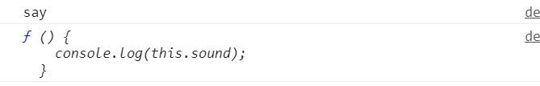

# 对象

对于 JS 而言，对象是一组无序的相关属性和方法的集合，所有的事务都是对象，例如字符串、数字、数组、函数。

对象是由属性和方法组成的，

属性是事物的特征，而方法是对象的行为。

对象可以用来描述某一个事物，当我们针对某一个特殊的事物时，我们希望在针对这个事物时，不需要重新描述一遍，譬如小兔子有白色毛的属性，有会跳的方法，我们把这些方法与属性封装起来，那么即使遇到不同的兔子，我们可以反复使用这些方法与属性。

## 对象创建

### 对象字面量创建对象

利用对象字面量创建对象{}，例：

```js
var obj={};
```

相关属性与方法就可以写进这个花括号中，例：

```js
var obj={
  name: '张三',

  say: function(){
    console.log("hello");
  }
}
```

可以看到对象的属性与方法是使用键值对的方式存储的，并且它们之间使用逗号隔开。

#### 调用对象属性

调用对象属性的语法格式为：

```js
对象名.属性名;
```

可以看到是使用`.`去访问一个对象的属性，例：

```js
obj.name;
```

还可以使用`对象名['属性名']`的方式访问属性。

### 利用 new Object 创建对象

在对象中我们可以用`new Object`创建一个对象，例：

```js
var obj_example=new Object();
obj_example.name="uname";
obj_example.printHi=function(){
  console.log("Hi");
};
```

可以看到它往对象内添加方法与属性只需要在对象后加点然后进行赋值就可以了。

### 构造函数创建对象

构造函数可以将对象中重复的方法和属性抽象出来封装到这个函数中。

构造函数语法格式：

```js
function 构造函数名(){
  this.属性 = 值;
  this.方法 = function(){};
}

new 构造函数名();
```

注意构造函数名的首字母要大写表示。

使用案例：

```js
function Animal(sound) {
  this.sound = sound;
  this.say = function () {
    console.log(this.sound);
  }
}

var cat=new Animal("喵~");
cat.say();
```

可以看到构造函数内的属性和方法必须要使用`this`，用于指向该对象，另外新对象创建也需要使用`new`来创建一个新的储存空间。

## 遍历对象

遍历对象可以使用`for... in... `循环，`in`会取出对象里的属性或方法名。例：

```js
function Animal(sound) {
  this.sound = sound;
  this.say = function () {
    console.log(this.sound);
  }
}

var cat=new Animal("喵~");
for(var i in cat){
  console.log(i);
}
```

运行结果输出：sound、say，如果要取出属性对应的属性值或者方法对象的函数，可以使用`cat[i]`。例：

```js
function Animal(sound) {
  this.sound = sound;
  this.say = function () {
    console.log(this.sound);
  }
}

var cat=new Animal("喵~");
for(var i in cat){
  console.log(i);
  console.log(cat[i]);
}
```

运行结果：


