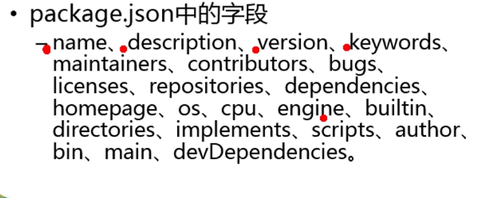

# node npm

## 包简介

包实际上相当于一个压缩文件，解压后会还原成目录，符合规范的包目录含：

1. package.json 描述性文件
2. bin\ 文件夹，文件夹中包含的是可执行的二进制文件
3. lib\ 文件夹，包含 JS 代码
4. doc\ 文档文件夹
5. test\ 单元测试文件夹

除了`package.json`外，其余文件都不是非必需文件。

`package.json`用于表达这个包内的各种相关信息。

`package.json`中可以包含的字段：

其中部分项的含义为：

* main：主文件
* dependencies: 项目环境依赖项
* description：描述文件
* devDependencies: 开发环境依赖
* scripts：运行脚本
* version: 版本
* bugs：bug提交的地址

## npm

`npm`是 Node Package Manager 的缩写，`npm`帮助完成了第三方模块的发布、安装和依赖。

`npm`常用的相关命令：

* npm -v：输出版本；
* npm version：输出详细的版本信息；
* npm search 包名：搜索指定包名；
* npm install 包名：安装指定包名的包；
* npm remove / r 包名：删除指定包名的包；
* npm install 包名 --save：安装并添加进依赖中；
* npm install 包名 -g：全局安装，一般是工具；
* npm init：项目的初始化，会在项目目录内生成一个`package.json`。

> 一般项目的所依赖的模块即`node_modules`目录下的模块都不会上传到代码托管平台上，因为一般这些依赖项会不断更新，上传显得并没有那么必要，那么一般会将模块作为依赖项进行安装，那么`package.json`文件中就会有相关记录，在从托管平台上下载下来的项目就可以使用`npm install`命令安装需要依赖的模块。

